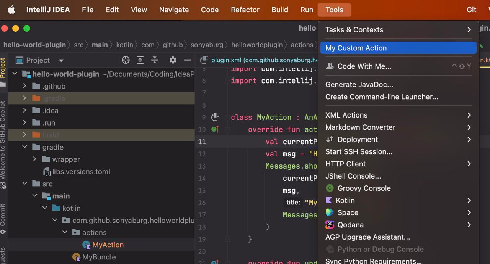

# hello-world-plugin

## Description
<!-- Plugin description -->
This Fancy IntelliJ Platform Plugin is my implementation of the test task for the internship at JetBrains Academy.

It adds a new action to the `Tools` menu that shows a popup with a `Hello World!` message.

<!-- Plugin description end -->

## Installation

As the plugin has not yet been published to the Marketplace, it can only be installed manually:

  Download the [latest release](https://github.com/SonyaBurg/hello-world-plugin/releases/latest) and install it manually using
  <kbd>Settings/Preferences</kbd> > <kbd>Plugins</kbd> > <kbd>⚙️</kbd> > <kbd>Install plugin from disk...</kbd>

---
Plugin based on the [IntelliJ Platform Plugin Template][template].

[template]: https://github.com/JetBrains/intellij-platform-plugin-template
[docs:plugin-description]: https://plugins.jetbrains.com/docs/intellij/plugin-user-experience.html#plugin-description-and-presentation
